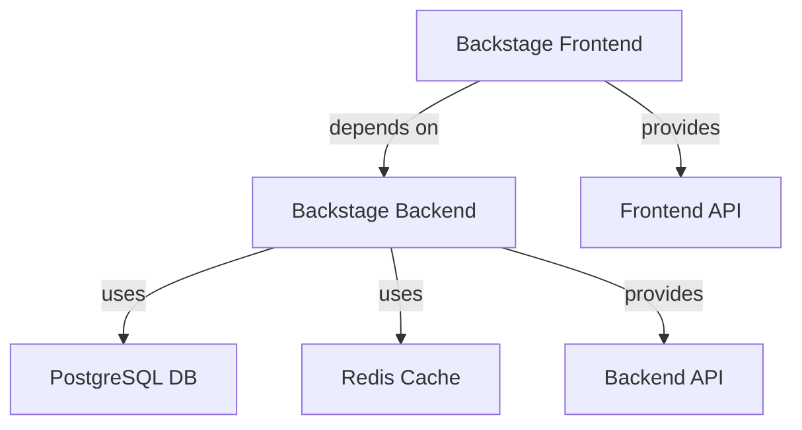

# Development Portal System

## Overview
The main development portal system that hosts our internal developer platform.

## Components
* [Backstage Frontend](../components/backstage-frontend.md)
* [Backstage Backend](../components/backstage-backend.md)

## Resources
* [PostgreSQL Database](../resources/postgres-db.md)
* [Redis Cache](../resources/redis-cache.md)

## APIs
* [Frontend API](../apis/frontend-api.md) - For catalog and search functionality
* [Backend API](../apis/backend-api.md) - For internal services

## Owner
* [Platform Team](../teams/team-platform.md)

## Architecture

## Features
* Software catalog
* Technical documentation
* API documentation
* Search functionality
* Template scaffolding

## Security
* Authentication via GitHub
* Role-based access control
* API authentication required
* Internal network access only

## Monitoring
* Health checks
* Performance metrics
* Error tracking
* Usage analytics

## Documentation
* User guides
* API documentation
* Component documentation
* Architecture diagrams
