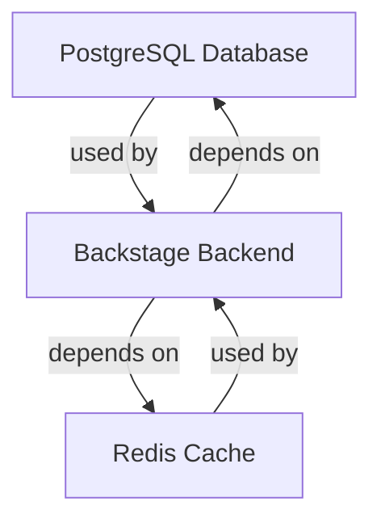

# Internal Tools System

## Overview
Internal tooling system that provides infrastructure and operational support for our development platform.

## Components
This system manages core infrastructure resources:
* [PostgreSQL Database](../resources/postgres-db.md)
* [Redis Cache](../resources/redis-cache.md)

## Owner
* [DevOps Team](../teams/team-devops.md)

## Architecture

## Monitoring
* Database metrics via Prometheus
* Cache performance monitoring
* Infrastructure health checks

## Access
* Internal network access only
* Managed by DevOps team
* Access controlled via IAM policies

## Documentation
* Infrastructure diagrams in Confluence
* Runbooks for common operations
* Disaster recovery procedures
